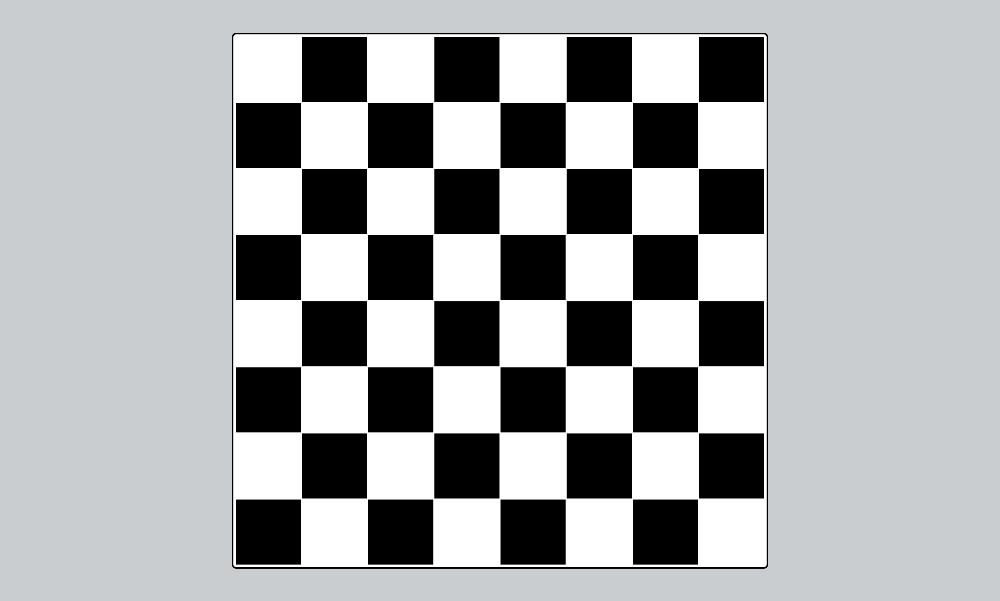

## HTML Chess Board

<hr />

### Project Preview



<br />

### Project Code

#### HTML Code

```html
<!DOCTYPE html>
<html lang="en">
  <head>
    <meta charset="UTF-8" />
    <meta http-equiv="X-UA-Compatible" content="IE=edge" />
    <meta name="viewport" content="width=device-width, initial-scale=1.0" />
    <link rel="stylesheet" href="./style.css" />
    <title>HTML Chess Board</title>
  </head>
  <body>
    <table class="chess-board">
      <tbody></tbody>
    </table>
    <script src="./script.js"></script>
  </body>
</html>
```

#### CSS Code

```css
* {
  margin: 0;
  padding: 0;
  box-sizing: border-box;
}

body {
  background-color: #cacdcf;
  display: grid;
  place-items: center;
  padding: 50px 15px;
}

.chess-board {
  border: 2.5px solid #000;
  border-radius: 7px;
  padding: 2.5px;
  background-color: #fff;
}

.chess-board > tbody {
  border: 2px solid #000;
}

.chess-board__square {
  width: 100px;
  height: 100px;
  margin: 0;
}

.chess-board__square.black {
  background-color: #000;
}

.chess-board__square.white {
  background-color: #fff;
}
```

#### JavaScript Code

```js
const chessBoard = document
  .querySelector('.chess-board')
  .querySelector('tbody');

let chessBoardTemplate = '';
chessBoardTemplate += '<tr>';

for (let i = 0; i < 8; i++) {
  let count = 0;
  if (i % 2 === 0) {
    count = 1;
  }

  for (let j = 0; j < 8; j++) {
    count += 1;
    let color = count % 2 === 0 ? 'white' : 'black';
    chessBoardTemplate += `<td class="chess-board__square ${color}"></td>`;
  }
  chessBoardTemplate += '</tr>';
}

chessBoard.innerHTML = chessBoardTemplate;
```

<hr />
